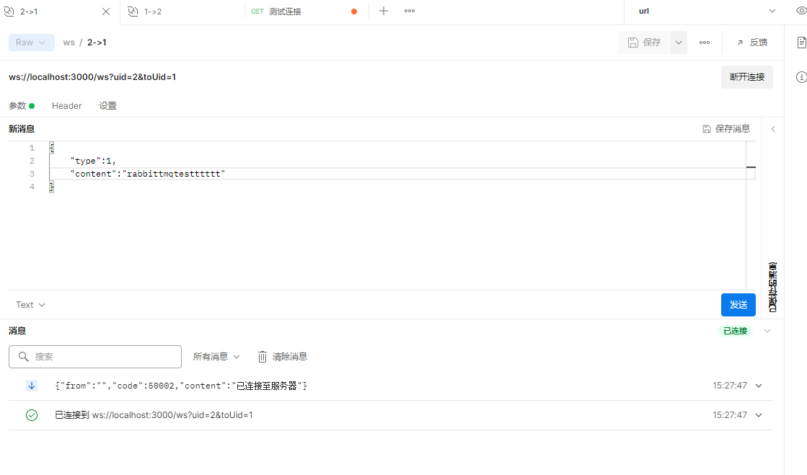

# gin-chat-demo
gin+websocket+mongodb实现 IM 即时聊天系统

> 
> 这个项目是基于WebSocket + MongoDB + MySQL + Redis。
> 业务逻辑很简单，只是两人的聊天。

- `MySQL` 用来存储用户基本信息
- `MongoDB` 用来存放用户聊天信息
- `Redis` 用来存储处理过期信息
- ·rabbitmq`做信息的异步入库


# 项目结构

```
gin-chat-demo/
├── cache
├── conf
├── e
├── model
├── router
└── service
```

- cache : 放置redis配置
- conf : 放置配置文件 
- model : 数据库模型
- pkg : 防止一些错误码
- router ： 路由模块
- service ：服务模块

# 项目功能

- 两人通信
- 在线、不在线应答
- 查看历史聊天记录

# 配置文件
- conf/config.ini

```ini
#debug开发模式,release生产模式
[service]
AppMode = debug
HttpPort = :3000 
# 运行端口号 3000端口

[mysql]
Db = mysql
DbHost = "" 
# mysql的ip地址
DbPort = ""
# mysql的端口号,默认3306
DbUser = ""
# mysql user
DbPassWord = ""
# mysql password
DbName = ""
# 数据库名字

[redis]
RedisDb = ""
# redis 名字
RedisAddr = ""
# redis 地址
RedisPw = ""
# redis 密码
RedisDbName = ""
# redis 数据库名

[MongoDB]
MongoDBName =  ""
MongoDBAddr = ""
MongoDBPwd = ""
MongoDBPort = ""
```

# 项目运行

- 下载依赖

```go
go mod tidy
```

- 执行

```go
go run main.go
```

# 演示
- 测试http连接


- 进行ws连接，连接服务器




- 当id=1上线，但是id=2没上线的时候发送消息


- 当id=2上线之后


- 再次发消息，就是在线应答了


- 这边就实时接受到消息了


- 获取历史信息


